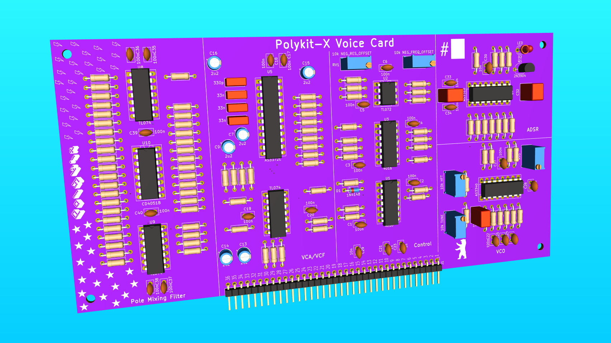

# Polykit-X Voice Card

This repository contains schematics and Kicad PCB layout for a voice card with pole-mixing multimode filter. Multiple cards like this are typically used in a polyphonic synthesizer. It can also be used in a monophonic setup. There is only minimal additional circuitry like some pots, input jacks and voltage regulators needed.

Voice card specs:

- Single oscillator with saw, triangle and pulse output
- Multiple VCAs to blend between different input signals, a main VCA for the envelope and a panning VCA for stereo output
- An additional external input that can be mixed in, eg. a noise signal
- One envelope generator for the VCA. It can modulate filter frequency and resonance, also with an inverted signal
- A pole-mixing multimode filter with 8 filter responses:
    - 4P LP
    - 2P LP
    - 4P HP
    - 2P HP
    - 4P BP
    - 2P BP
    - 3P AP + 1P LP
    - 4P N
- There are multiple options two switch and blend between different signals and filter responses
- PWM, FM and synchronization inputs

Video playlist on its functionality and design process: https://www.youtube.com/watch?v=2grRbG7IwDw&list=PLUKLEU8jmlbHH4_13YZM0MI6ez4gYQPfy

## Printed Circuit Boards

Geber files for PCB production [can be downloaded here](plots/). There is a small batch of PCBs for sale on Tindie. If you like to support me you can get them from https://www.tindie.com/products/27330/

## Pinout

| Pin # | Description          | Short         | Voltage Range | Type   | Direction | Note |
|-------|----------------------|---------------|---------------|--------|-----------|------|
| 1     | Ground               | GND           |               |        |           |
| 2     | +12V                 | +12V          |               |        |           |
| 3     | -12V                 | -12V          |               |        |           |
| 4     | +5V                  | +5V           |               |        |           |
| 5     | -5V                  | -5V           |               |        |           |
| 6     | Pitch control        | PITCH         | ±5V           | CV     |           | 1
| 7     | PWM                  | PWM           | 0V to 5V      | CV     |           |
| 8     | FM                   | FM            |               | Signal |           |
| 9     | Soft sync            | SSYNC         |               | Signal |           |
| 10    | Hard sync            | HSYNC         |               | Signal |           |
| 11    | Envelope Attack      | ADSR_A        | 0V to -5V     | CV     |           |
| 12    | Envelope Decay       | ADSR_D        | 0V to -5V     | CV     |           |
| 13    | Envelope Sustain     | ADSR_S        | 0V to 5V      | CV     |           |
| 14    | Envelope Release     | ADSR_R        | 0V to -5V     | CV     |           |
| 15    | Envelope Trigger     | TRIG          | 0V/5V         | Trig   |           |
| 16    | Envelope Gate        | GATE          | 0V/5V         | Gate   |           |
| 17    | Envelope Output      | ADSR_OUT      | 0V to 5V      | CV     |           |
| 18    | Enable saw signal    | SAW_ON        | 0V/5V         | Switch |           |
| 19    | Enable triangle sig. | TRIANGLE_ON   | 0V/5V         | Switch |           |
| 20    | Enable ext. signal   | EXTERNAL_ON   | 0V/5V         | Switch |           |
| 21    | Neg. freq. by ADSR   | FREQ_ADSR_NEQ | 0V/5V         | Switch |           |
| 22    | Freq. by ADSR        | FREQ_ADSR     | 0V/5V         | Switch |           |
| 23    | Res. by ADSR         | RES_ADSR      | 0V/5V         | Switch |           |
| 24    | Neg. res. by ADSR    | REF_ADSR_NEQ  | 0V/5V         | Switch |           |
| 25    | Input level 1        | LVL1          | 0V to 5V      | CV     |           |
| 26    | Input level 2        | LVL2          | 0V to 5V      | CV     |           |
| 27    | VCA                  | VCA_CV        | 0V to 5V      | CV     |           |
| 28    | Output panning       | PAN_CV        | -2V to 2V     | CV     |           |
| 29    | External input       | EXTERNAL_IN   |               | Signal |           |
| 30    | Freq. control        | FREQ_CV       | 0V to 5V      | CV     |           |
| 31    | Res. control         | RES_CV        | 0V to 5V      | CV     |           |
| 32    | Filter mode A        | FILTER_MODE_A | 0V/5V         | Switch |           |
| 33    | Filter mode B        | FILTER_MODE_B | 0V/5V         | Switch |           |
| 34    | Filter mode C        | FILTER_MODE_C | 0V/5V         | Switch |           |
| 35    | Output left          | OUT_L         |               | Signal |           | 2
| 36    | Output right         | OUT_R         |               | Signal |           | 2

Note 1: A 100k ohm resistor on pitch CV input is needed. Multiple CV sources can be added by using multiple resistors in parallel

Note 2: Max. output volume can be adjusted by changing R32/R33

## Filter modes

| # | C B A | Filter response |
|---|-------|-----------------|
| 0 | 0 0 0 | 4P LP           |
| 1 | 0 0 1 | 2P LP           |
| 2 | 0 1 0 | 4P HP           |
| 3 | 0 1 1 | 2P HP           |
| 4 | 1 0 0 | 4P BP           |
| 5 | 1 0 1 | 2P BP           |
| 6 | 1 1 0 | 3P AP + 1P LP   |
| 7 | 1 1 1 | 4P N            |

Select filter mode on pins 32-34

0=GND, 1=5V

## Tuning Procedure

### VCO

### Negative frequency response

### Negative resonance response

### BOM

|Reference                                                                                                      |Qnty|Value              |Description                                                                                           |
|---------------------------------------------------------------------------------------------------------|----|-------------------|------------------------------------------------------------------------------------------------------|
|C1, C2, C3, C4, C5, C6, C17, C18, C19, C20, C22, C27, C28, C33, C34, C35, C36, C37, C38, C39, C40       |21  |100n               |Unpolarized capacitor                                                                                 |
|C7, C9, C13, C14, C15, C16                                                                              |6   |2,2uF                |Polarized capacitor                                                                                   |
|C8,                                                                                                      |1   |330p               |Unpolarized capacitor, film or mylar                                                                              |
|C10, C11, C12                                                                                           |3   |33n                |Unpolarized capacitor, film or mylar                                                                                  |
|C21, C23                                                                                                |2   |1n                 |Unpolarized capacitor                                                                                 |
|C24, C25, C29, C30                                                                                      |4   |10n                |Unpolarized capacitor                                                                |
|C26                                                                                                     |1   |1n*                |Unpolarized capacitor, *polypropylene or similar                                                                                 |
|C31                                                                                                     |1   |10n*               |Unpolarized capacitor, *polypropylene or similar                                                                 |
|C32                                                                                                     |1   |33n*               |Unpolarized capacitor, *polypropylene or similar                                                                  |
|D1                                                                                                      |1   |1N4148             |100V 0.15A standard switching diode, DO-35                                                            |
|D2                                                                                                      |1   |LED                |3mm                                                                                  |
|J1                                                                                                      |1   |Conn_01x36         | Pin header 2.54mm 1x36pin 90 degree angle
|Q1                                                                                                      |1   |2N3904             | NPN Transistor, TO-92                                                  |
|R1, R3, R4, R43, R44                                                                                    |5   |1M                 |Resistor                                                                                              |
|R2, R28, R29, R42                                                                                       |4   |470k               |Resistor                                                                                              |
|R5, R6, R7, R21, R22, R24, R25, R54, R55, R56, R60, R63, R68, R73, R74, R75, R76, R93, R101, R102, R103 |21  |10k                |Resistor                                                                                              |
|R8, R9, R10, R11, R12, R13, R14, R15, R18, R19, R20, R69, R70, R71                                      |14  |100k               |Resistor                                                                                              |
|R16, R17, R23                                                                                           |3   |20k                |Resistor                                                                                              |
|R26, R27, R41, R72                                                                                      |4   |68k                |Resistor                                                                                              |
|R30, R31, R34, R35, R37, R64, R65, R66, R67                                                             |9   |1k                 |Resistor                                                                                              |
|R32, R33, R36, R62                                                                                      |4   |33k                |Resistor                                                                                              |
|R39, R40                                                                                                |2   |22k                |Resistor                                                                                              |
|R45                                                                                                     |1   |330k               |Resistor                                                                                              |
|R46                                                                                                     |1   |1M5                |Resistor                                                                                              |
|R47, R48, R57, R58, R59                                                                                 |5   |470                |Resistor                                                                                              |
|R49                                                                                                     |1   |24k                |Resistor                                                                                              |
|R50                                                                                                     |1   |5k6                |Resistor                                                                                              |
|R51                                                                                                     |1   |1k8                |Resistor                                                                                              |
|R52                                                                                                     |1   |10M                |Resistor                                                                                              |
|R53                                                                                                     |1   |47k                |Resistor                                                                                              |
|R61                                                                                                     |1   |680                |Resistor                                                                                              |
|R77, R79, R80, R81, R82, R86, R87, R89, R90, R91, R92, R96                                              |12  |30k                |Resistor                                                                                              |
|R78, R88, R97, R98, R99, R100                                                                           |6   |15k                |Resistor                                                                                              |
|R83, R85, R95                                                                                           |3   |7k5                |Resistor                                                                                              |
|R84, R94                                                                                                |2   |4k99               |Resistor                                                                                              |
|R104                                                                                                    |1   |4k7                |Resistor                                                                                              |
|RV1                                                                                                     |1   |10k NEG_RES_OFFSET |Trim-potentiometer                                                                                    |
|RV2                                                                                                     |1   |10k NEG_FREQ_OFFSET|Trim-potentiometer                                                                                    |
|RV3                                                                                                     |1   |10k TUNE           |Trim-potentiometer                                                                                    |
|RV4                                                                                                     |1   |10k HFT            |Trim-potentiometer                                                                                    |
|RV5                                                                                                     |1   |10k SCALE          |Trim-potentiometer                                                                                    |
|U1, U3                                                                                                  |2   |4016               |Quad Analog Switches                                                                                  |
|U2                                                                                                      |1   |TL072              |Dual Low-Noise JFET-Input Operational Amplifiers, DIP-8/SOIC-8                                        |
|U4, U8, U9                                                                                              |3   |TL074              |Quad Low-Noise JFET-Input Operational Amplifiers, DIP-14/SOIC-14                                      |
|U5                                                                                                      |1   |AS3372E            |4-pole VCF, dual channel input mixer, VCA, panning VCA                                                                                                     |
|U6                                                                                                      |1   |AS3340             |Voltage Controlled Oscillator (VCO), DIP-16/SOIC-16                                                   |
|U7                                                                                                      |1   |AS3310             |ADSR Voltage Controlled Envelope Generator, DIP-16/SOIC-16                                            |
|U10                                                                                                     |1   |CD4051B            |CMOS single 8-channel analog multiplexer demultiplexer, TSSOP-16/DIP-16/SOIC-16                       |

## References

Article on Pole Mixing Filters: https://electricdruid.net/multimode-filters-part-2-pole-mixing-filters

Oberheim Matrix-12 Service Manual: https://archive.org/details/oberheim_MATRIX-12_SERVICE_MANUAL

Oberheim Xpander Service Manual: https://archive.org/details/oberheim_XPANDER_SERVICE_MANUAL

Sequential Prophet T8 Service Manual: https://archive.org/details/sm_SCI_T8_Service_Manual_Complete_sm

AS3372E Datasheet: https://www.ericasynths.lv/media/AS3372E.pdf

AS3310 Datasheet: https://www.alfarzpp.lv/eng/sc/AS3310.pdf

AS3340 Datasheet: https://www.alfarzpp.lv/eng/sc/AS3340.pdf
